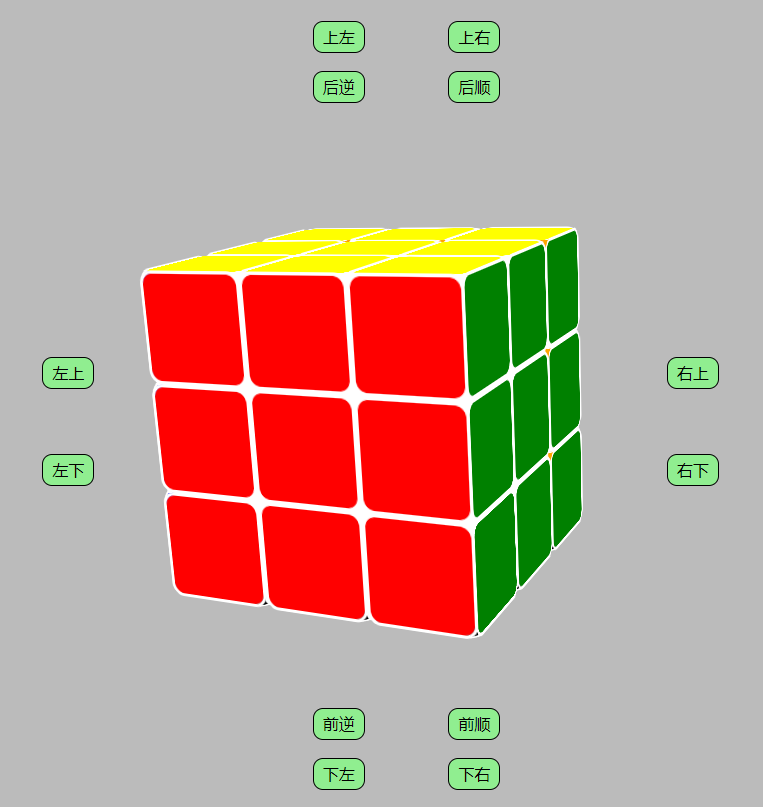
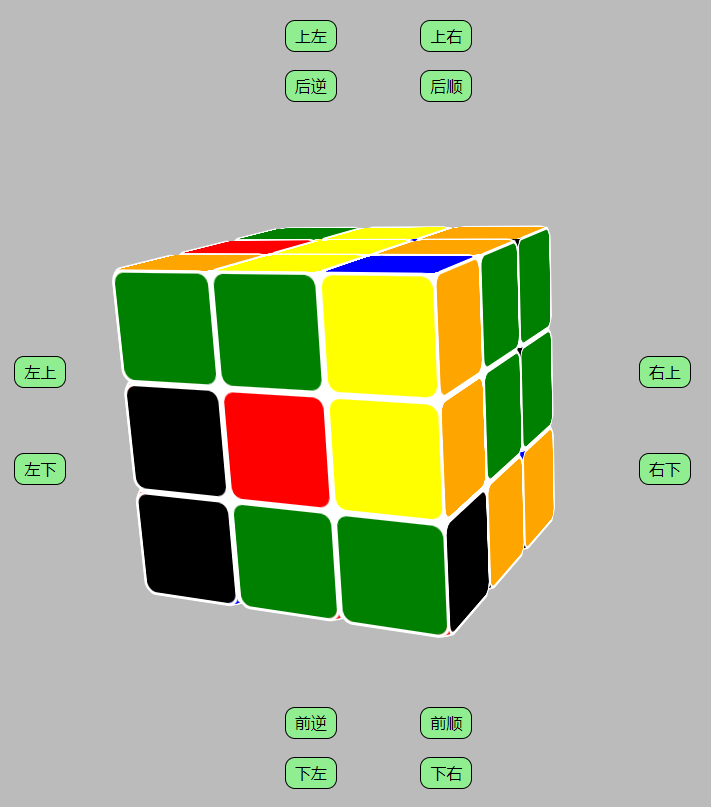

### DIY类demo
该demo为一个3d魔方，而且可以玩，不是这只能看的  
该demo是在3dRotateCube的基础上实现的，运用3dRoateCube中的3d旋转函数  
但是不完全是，因为魔方的整体旋转和玩魔方时拨动的旋转的对象、轴之类的都不一样  
所以需要在其基础上做一些修改  
效果如下：（不知道怎么放视频）
  
  
要实现一个魔方的样式并不难，但是为了保证旋转的时候是绕中心旋转  
设置样式的时候需要整体图形一定要是以魔方的中心对称的  
#### 坐标系确定
首相需要弄清楚的是，魔方的六个面，是以什么为参照物进行旋转的  
是以页面的坐标系旋转？还是以父节点的坐标系旋转呢？  
其实这个问题不需要清楚原理，只需要证明就行了：  
我的dom结构是section为根父节点，然后子代是27个brick_div表示27个方块  
我们先旋转section即整个魔方，此时获取section的computed_transform值  
很显然是一个非单位矩阵，表明section整体已经产生了旋转形变  
然后我们再获取其中一个brick_div的computed_transform值  
可以发现，每个div的值都是matrix(1,0,0,1,0,0),即是未旋转的状态  
由此已经可以证明，所有brick_div都是以父节点的坐标系进行旋转的  
那么问题就变得相对简单了，不同于整体旋转，单个面的旋转的旋转轴一定是xyz轴  
即旋转轴的方向向量只能是e=(+-1, 0, 0) 或 (0, +-1, 0) 或 (0, 0, +-1)  
#### 单个面旋转实现
前面已经说明过，在设计样式的时候需要把每个方块都以魔方中心点对称  
所以此时我们同时获取一个面的9个brick_div，然后分别旋转，但表现为都绕中心方块旋转  
看起来就像是整体一起旋转  
但是不同于魔方整体旋转，单个dom旋转时不需要考虑旋转先后顺序，直接把动画帧执行完就行  
但是现在是9个div一起旋转，则要考虑顺序，一个个旋转一帧，然后再request下一帧  
然后旋转轴方向向量e的判断  
根据右手螺旋定则确定，大拇指方向为e方向，但是要注意html中的坐标系中，第一象限在右下角  
```javascript
function rotateAnimationField(){
    fieldCounter++;
    let FN = 30; //帧数

    fieldTheta = Math.PI/2;

    for(let dom of field){
        fieldMatrixStr = document.defaultView.getComputedStyle(dom, null).transform;  //获取浏览器计算后的cubic的3d矩阵值
        
        let nums = fieldMatrixStr.replace(/(matrix3d\()|[ \)]/g, "").split(",").map((item)=>+item);
        if(nums.length != 16){
            fieldMatrix = [[1,0,0,0],
                            [0,1,0,0],
                            [0,0,1,0],
                            [0,0,0,1]]
        }else{
            fieldMatrix = math.matrix([nums.slice(0,4),
                                nums.slice(4,8),
                                nums.slice(8,12),
                                nums.slice(12,16)])
        }
        myrotate3d(fieldMatrix, field_e, fieldTheta / FN, dom); 
    }
    
    if(!(fieldCounter%FN)) {  //100帧，停止
        cancelAnimationFrame(field_rID);
        field_rID = null;  
        fieldCounter = 0;
        return
    }
    field_rID = requestAnimationFrame(rotateAnimationField);
}
```
但是不同于整体旋转中多次触发事件停止上一次动画  
单个面的旋转必须要等到上一次动画结束才能执行下一次动画  
这里的处理是不同的  
```javascript
function rotateOne(choice){ //根据按钮旋转指定的面90度
    if(field_rID){//如果上一次动画还未结束, 不执行
        return;
    }
    //先获取对应面的9个bricks，并确定旋转轴的单位向量
    getField(choice);

    //获取到后就可以开始旋转
    rotateAnimationField();

    //旋转过后还需要改变其位置类
    changePosition(choice)
}
```
#### 旋转对象即9个brick_div的获取
我目前的写法是根据brick的位置，给它位置类  
这些类包括：front, behind, left, right, top, bottom, mid, center  
其中六个面的中间就是center，只有两个颜色的块就是mid，除了center，每个brick都有三个类  
然后根据旋转的目标，用querySelectorAll根据类名来获取9个brick并确定e  
但是始终觉得这种写法实在是太垃圾了，还很繁琐  
不如设计一个brick类，绑定brick_div，然后保存其位置信息  
后面将做出改进


